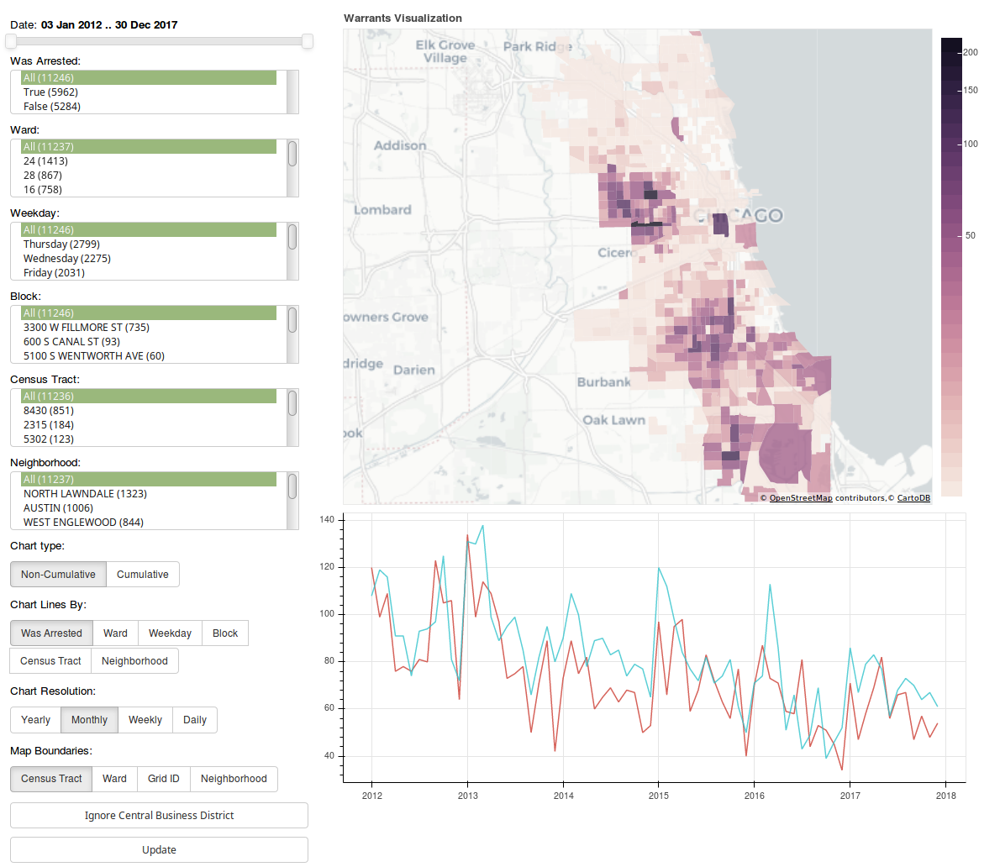

# Chicago Police Search Warrant Data

*(This project is in active development!)*



https://viz.mchap.io/search_warrants

## Data
### What is it?
Locations of where search warrants were executed, and whether an arrest was made.

### What is it not?
The data does not include warrants either not approved, never acted on, or available from reporting difficulties, and are not included in the dataset or visualisations. 

**Note**: Not all search warrants lead to arrests. In fact, you may see a lot of search warrants for "3300 W Fillmore St" which is the same building as CPD's Evidence Collection Unit. (As decided in Riley vs California, yes police do need to get a warrant to search your phone).

### How did you get it?
We received this data through the Illinois Freedom of Information Act (FOIA). Access to the information was initially denied, but through a year long appeals process with the Illinois Attorney General, an opinion was given that legally required Chicago to provide the records. 

[Original Request](https://www.muckrock.com/foi/chicago-169/search-warrant-log-chicago-police-department-73550/)

### We're looking for more:
[CPD Search Warrants Request](https://www.muckrock.com/foi/chicago-169/complaint-for-search-records-chicago-police-department-77766/)

[CCSAO Search Warrants Request](https://www.muckrock.com/foi/cook-county-365/complaint-for-search-records-cook-county-states-attorneys-office-77767/)

### Building:

```
sudo apt install make postgresql-10 python3-pip postgresql-server-dev-10 jq gdal-bin postgresql-10-postgis-2.4
git clone https://github.com/lucyparsons/cpdsearchwarrants.git
pip3 install -r pipfile
cd cpdsearchwarrants
make
```


#### Geocoded csv format:
```"Search Warrant #","Type of Warrant","Date","Address Merged","Address","STREET_DIR","STREET_NAME","City","State","Country","WAS_ARRESTED","lng","lat"
"12SW4004","SEARCH","3-Jan-12","1300 N LOREL AVE",1300,"N","LOREL AVE","CHICAGO","ILLINOIS","USA","N",-87.759324,41.90418
"12SW4001","SEARCH","3-Jan-12","500 N ST LOUIS AVE",500,"N","ST LOUIS AVE","CHICAGO","ILLINOIS","USA","Y",-87.713736,41.890986
"12SW4017","SEARCH","4-Jan-12","1700 N LUNA AVE",1700,"N","LUNA AVE","CHICAGO","ILLINOIS","USA","Y",-87.763944,41.911361
"12SW4013","SEARCH","4-Jan-12","5700 S THROOP ST",5700,"S","THROOP ST","CHICAGO","ILLINOIS","USA","N",-87.656866,41.790349
"12SW4023","SEARCH","4-Jan-12","8800 S ESCANABA AVE",8800,"S","ESCANABA AVE","CHICAGO","ILLINOIS","USA","N",-87.553758,41.735382
"12SW4025","SEARCH","4-Jan-12","800 N WALLER AVE",800,"N","WALLER AVE","CHICAGO","ILLINOIS","USA","N",-87.767826,41.894668
```

#### GeoJSON format:
```      
"properties": {
        "ward": 29,
        "neighborhood": "AUSTIN",
        "date": "2012-01-04 00:00:00",
        "is_business_district": false,
        "type_of_warrant": "SEARCH",
        "street_name": "WALLER AVE",
        "date_month": 1,
        "city": "CHICAGO",
        "search_warrant_num": "12SW4025",
        "date_day": "Wednesday",
        "grid_id": 9874,
        "street_dir": "N",
        "state": "ILLINOIS",
        "census_tract": "2514",
        "address_merged": "800 N WALLER AVE",
        "address as street_num": 800,
        "date_hour": 0,
        "date_year": 2012,
        "was_arrested_tbl.was_arrested": false
      }
```

## Download Data
[Original Data](https://github.com/lucyparsons/cpdsearchwarrants/blob/master/P494685_Chicago_SearchWarrants.csv)

[Geocoded Data](https://github.com/lucyparsons/cpdsearchwarrants/blob/master/P494685_Martinez_Freddy_Chicago_SWs.geocoded.csv)

[Postgres dump](https://cpdwarrantsdumps.s3.us-east-2.amazonaws.com/warrants.pg_dump.sql.gz)

[Geojson](https://github.com/lucyparsons/cpdsearchwarrants/blob/master/chicago_search_warrants.geojson)
